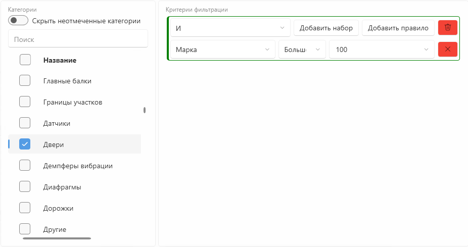
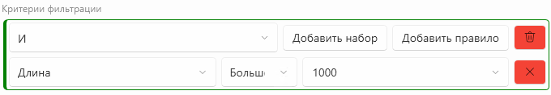

# Bim4Everyone.RevitFiltration

Bim4Everyone.RevitFiltration — это библиотека C#, разработанная для упрощения создания `ElementFilter`. Библиотека
состоит из двух основных частей: **RevitFiltration** и **RevitFiltration.Controls**.
RevitFiltration.Controls можно использовать для создания `ElementFilter`, передавая его непосредственно в метод
`WherePasses` класса `FilteredElementCollector`.
RevitFiltration.Controls предоставляет пользователю возможность создавать пользовательские фильтры непосредственно в UI,
сохранять их и использовать повторно.

Контрол с возможностью выбрать категории фильтрации и задать правила для параметров:



Контрол с возможностью только задавать правила параметров:



## Bim4Everyone.RevitFiltration

### Необходимые зависимости

- pyRevitLabs.Json
- Ninject
- dosymep.Revit
- dosymep.Bim4Everyone

### Подключение к плагину

1. Подключить ссылку на Bim4Everyone.RevitFiltration.dll в .csproj:

```
<ItemGroup Condition="$(RevitVersion) != ''">
    <Reference Include="Bim4Everyone.RevitFiltration">
        <HintPath>$(AppData)\pyRevit\Extensions\BIM4Everyone.lib\dosymep_libs\libs\$(RevitVersion)\Bim4Everyone.RevitFiltration.dll</HintPath>
        <Private>False</Private>
    </Reference>
</ItemGroup>
```

2. Зарегистрировать в ninject DI контейнере плагина необходимые сервисы:

```
kernel.UseLogicalFilterFactory(); // сервис для создания фильтра (обязательно)
kernel.UseLogicalFilterParser(); // сервис для сериализации и десериализации фильтра (опционально)
```

3. Задать настройки генерации фильтра через класс `Options`.

> Интерфейс `IOptions` устарел (`[Obsolete]`). Используйте класс `Options`. Старые перегрузки `Build(Document, IOptions)`
> сохранены для обратной совместимости.

### Пример использования в плагине

Из DI контейнера необходимо получить сервис `ILogicalFilterFactory`, затем сконструировать необходимый фильтр и
сгенерировать `ElementFilter`, используя класс `Options`. Чтобы сгенерировать фильтр по типоразмерам (а не по
экземплярам), установите `Options.FilterByType = true`. Пример:

```
public void SampleFilterCreation(ILogicalFilterFactory filterFactory, Autodesk.Revit.UI.UIDocument uiDoc) {
    ILogicalFilter filter = filterFactory.CreateAndFilter()
        .AddEqualsRule(BuiltInParameter.SCHEDULE_LEVEL_PARAM, "Level 1");

    var opts = new Options { Tolerance = 1e-6, FilterByType = false };
    var elements = new FilteredElementCollector(uiDoc.Document)
        .WhereElementIsNotElementType()
        .OfCategory(BuiltInCategory.OST_Planting)
        .WherePasses(filter.Build(uiDoc.Document, opts))
        .ToElementIds();
    uiDoc.Selection.SetElementIds(elements);
}

public void SampleFilterParsing(ILogicalFilter filter, ILogicalFilterParser parser) {
    string str = parser.Serialize(filter);

    bool success = parser.TryParse(str, out ILogicalFilter newFilter);
}
```

## Bim4Everyone.RevitFiltration.Controls

### Необходимые зависимости

То же, что и для Bim4Everyone.RevitFiltration и:

- WPF-UI

### Подключение к плагину

1. Подключить ссылки на Bim4Everyone.RevitFiltration.dll и Bim4Everyone.RevitFiltration.Controls.dll в .csproj
2. Зарегистрировать в ninject DI контейнере плагина необходимые сервисы:

```
kernel.UseLogicalFilterFactory(); // сервис для создания ILogicalFilter (обязательно)
kernel.UseLogicalFilterProviderFactory(); // сервис для привязки провайдера контекста фильтра из UI к ViewModel (обязательно)
kernel.UseFilterContextParser(); // сервис для сериализации и десериализации контекста фильтра UI (опционально)
```

3. Сконструировать `DataProvider` (для значений параметров — по экземплярам элементов либо через собственную функцию).

> Интерфейс `IDataProvider` устарел (`[Obsolete]`). Используйте класс `DataProvider`. Старые перегрузки
> `ILogicalFilterProviderFactory.Create(IDataProvider ...)` сохранены для обратной совместимости.

У класса `DataProvider` два конструктора:

- значения параметров берутся из экземпляров элементов заданных документов:
  `DataProvider(categories, getParams, documents)`;
- значения параметров переопределяются собственной функцией (можно вернуть свой список значений):
  `DataProvider(categories, getParams, getParamValues)`.

Обоим конструкторам нужны функции получения доступных категорий и параметров. Их можно описать один раз и
переиспользовать в любом из примеров ниже:

```
ICollection<Category> GetCategories(Document doc) {
    return ParameterFilterUtilities.GetAllFilterableCategories()
        .Select(c => Category.GetCategory(doc, c))
        .Where(category => category != null)
        .Where(c => c.CategoryType == CategoryType.Model && c.IsVisibleInUI)
        .ToArray();
}

ICollection<RevitParam> GetParams(Document doc, ICollection<Category> categories) {
    return ParameterFilterUtilities
        .GetFilterableParametersInCommon(doc, [..categories.Select(c => c.Id)])
        .Select(paramId => GetFilterableParam(doc, paramId))
        .Where(p => p != null)
        .ToArray();
}

RevitParam GetFilterableParam(Document doc, ElementId paramId) {
    try {
        if(paramId.IsSystemId()) {
            return SystemParamsConfig.Instance.CreateRevitParam(doc, (BuiltInParameter) paramId.GetIdValue());
        }

        var element = doc.GetElement(paramId);
        if(element is SharedParameterElement sharedParameterElement) {
            return SharedParamsConfig.Instance.CreateRevitParam(doc, sharedParameterElement.Name);
        }

        if(element is ParameterElement parameterElement) {
            return ProjectParamsConfig.Instance.CreateRevitParam(doc, parameterElement.Name);
        }
        return null;
    } catch(Exception) {
        return null;
    }
}
```

Пример 1. Значения параметров берутся из экземпляров элементов заданных документов:

```
var dataProvider = new DataProvider(
    GetCategories(doc),
    categories => GetParams(doc, categories),
    new[] { doc });
```

Пример 2. Значения параметров задаются собственной функцией (можно вернуть свой список значений из любого
источника — базы данных, конфига, фиксированного списка и т.п.):

```
ICollection<string> GetCustomValues(ICollection<Category> categories, RevitParam revitParam) {
    // здесь — любой свой источник значений; для примера возвращаем фиксированный список
    return ["Значение 1", "Значение 2"];
}

var customDataProvider = new DataProvider(
    GetCategories(doc),
    categories => GetParams(doc, categories),
    (categories, revitParam) => GetCustomValues(categories, revitParam));
```

4. Настроить ViewModel окна:

```
internal class YourViewModel {
    public YourViewModel(
        ILogicalFilterProviderFactory filterProviderFactory,
        ILanguageService languageService,
        DataProvider dataProvider) {
        FilterProvider = filterProviderFactory.Create(dataProvider);
        LanguageService = languageService;
    }

    public ILogicalFilterProvider FilterProvider { get; } // провайдер для получения фильтра из UI
    public ILanguageService LanguageService { get; } // сервис для установки локализации в контроле
}
```

Чтобы открыть в контроле уже готовый `ILogicalFilter` (например, полученный из `ILogicalFilterParser.TryParse`),
используйте перегрузку `Create` с фильтром и категориями, для которых он был задан:

```
FilterProvider = filterProviderFactory.Create(
    dataProvider,
    filter,
    new[] { BuiltInCategory.OST_Walls, BuiltInCategory.OST_Floors });
```

Фильтр загружается только целиком: если хотя бы одна категория недоступна в `DataProvider` либо хотя бы одно правило
не удается сопоставить с доступными для этих категорий параметрами, провайдер вернет `CanGetFilter() == false`
и контрол откроется пустым — так же, как при загрузке несовместимого `ILogicalFilterContext`.

`ILogicalFilterProvider` уведомляет об изменении контекста фильтра событием `FilterContextChanged`:

```
FilterProvider.FilterContextChanged += (sender, args) => {
    // args.OldContext, args.NewContext
};
```

5. Подключить нужный контрол в xaml:

```
xmlns:filtration="clr-namespace:Bim4Everyone.RevitFiltration.Controls.Views;assembly=Bim4Everyone.RevitFiltration.Controls"
<filtration:DynamicCategoriesFilterControl
    LanguageService="{Binding LanguageService}"
    LogicalFilterProvider="{Binding FilterProvider}" />
```

## Сборка проекта

Компиляция проекта в папку `bin`

```
nuke compile
```

Компиляция проекта в `Bim4Everyone.lib\dosymep_libs\libs`

```
nuke publish
```

## Генерация документации

Для запуска необходима установка [docfx](https://dotnet.github.io/docfx/)

```
nuke docs-compile
```

## Запуск тестов

```
nuke test
```
